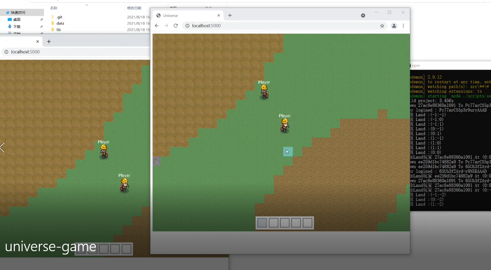

# Universe

## Multi-Player Game

这是一个基于 `pixi.js` 、 `socket.io` 和 `loki.js` 的一个 **事件驱动** 的多人实时网络游戏的 TypeScript 实现。



## Play 

本项目在 CI 上持续集成/部署 master 分支的最新版本


可以随时访问：
<http://play.unijs.org/>

来体验游玩构建版本

## CI / CD

查看最新构建状态：<http://ci.unijs.org/>

## Arch Design


在源码的具体实现中，使用了 `控制反转容器` 来进行依赖注入 `Manager` 与 `Service`。

实体层部分，使用 `loki.js` 对实体进行建模、查找。

事件总线与连接管理的部分，则使用了 `socket.io` 提供可靠的实现。

## Project & Game goal

项目的主要目标是完成这款游戏的各种核心玩法，次要目标是验证这个事件驱动的、同步、分发状态的游戏架构。

设计的主要游玩目标是参考 `Minecraft` 这款游戏的，来制作一个具有无限地图、多人实时在线的 **2D 沙盒游戏**。

## Start Developing

部署开发环境并启动本游戏程序，通过如下的流程：

首先在本地克隆项目：
```bash
git clone https://github.com/wyattzheng/universe
```

然后，在项目目录下创建一个 `.env` 文件, 
来指定地图等持久化数据的存储目录。

```
DB_LOCATION=./data/
```

依次执行命令：

```bash
yarn # 安装项目依赖
yarn start:server # 启动服务端
yarn start:client # 启动客户端
```
之后访问客户端对应的网页地址，即可进入游戏程序。

## Contribute

作者会持续完善本项目。除此之外，如果你也感兴趣，欢迎来自你的贡献。

包括但不限于：Issue、Merge Request、RFC 等都是对本项目的直接贡献。

## LICENSE

本项目以 MIT 协议开放源代码。
